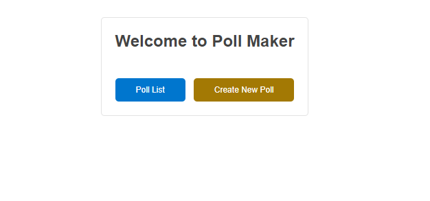
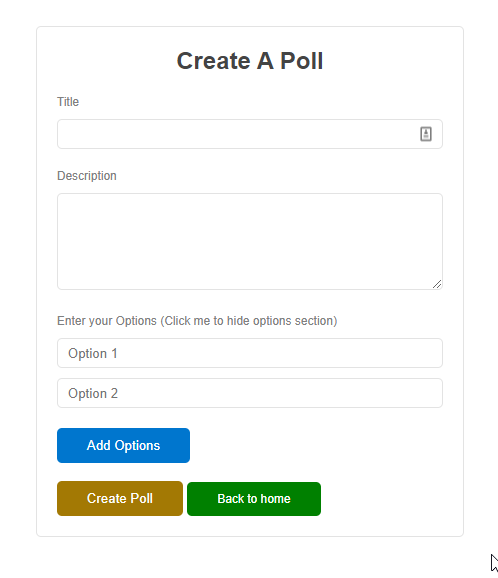
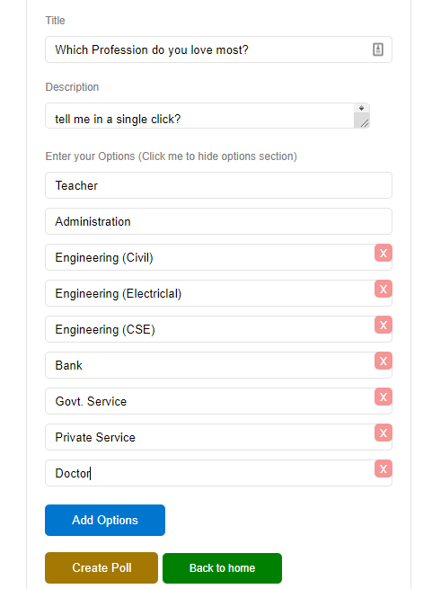
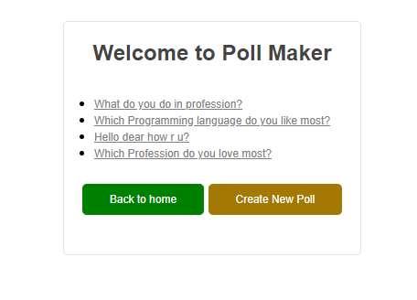
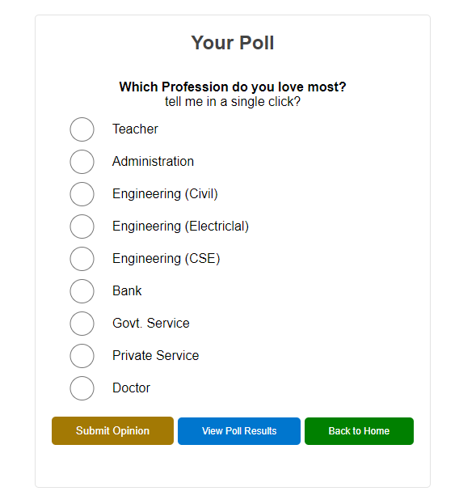
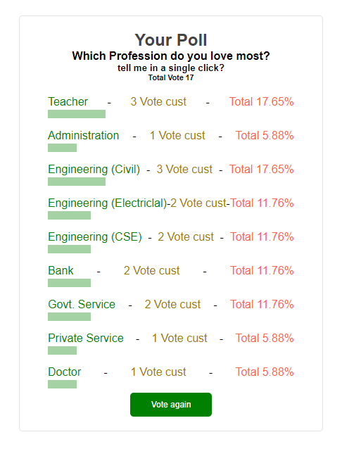

## POLL APP Using Nodejs Express and EJS Template engine

## home

Click Create New Poll

## Create Poll

Click Poll Fillup form

## Fillup Poll Form

After submition

## Poll List

After go to list click on your poll

## Poll Opinion Submission form

Result in count and percentage

## Poll Result

